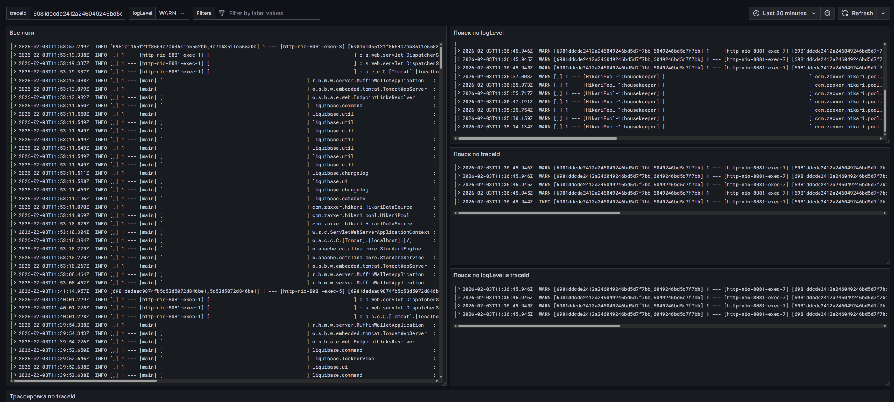
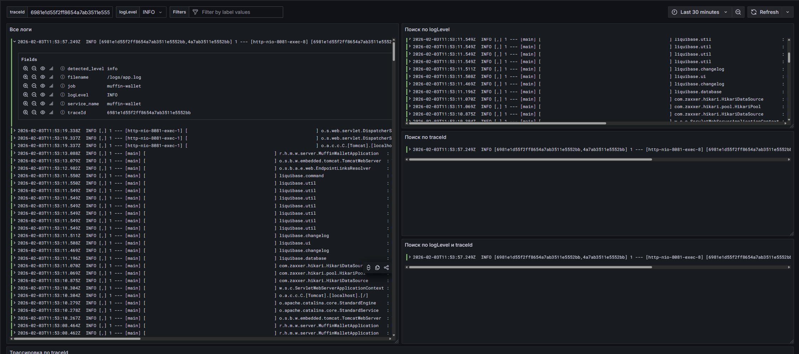
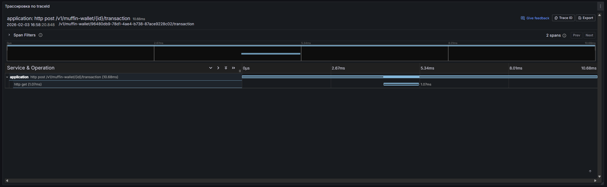

# Евсюков Александр БПИ224

## Задание
`Описание`

Развернуть приложения muffin-wallet и muffin-currency в среде Kubernetes (minikube) и настроить сбор логов и трейсов 
без использования opentelemetry.

`Задание`
- Разверните приложение muffin-wallet внутри кластера Kubernetes (minikube), используя
манифесты Kubernetes или Helm-chart.
- Разверните приложение muffin-currency внутри кластера Kubernetes (minikube), используя
манифесты Kubernetes или Helm-chart.
- Обеспечьте сбор логов из приложения muffin-wallet.
- Обеспечьте сбор трейсов системы.
- Подготовить отчет с инструкцией по запуску и готовыми скриптами для проверки
работоспособности системы.

Манифесты/helmfile/helmchart должны быть приложены.
Можно сдавать без использования istio

`Критерии оценивания`
- 0 - 4 Loki развернут, система работоспособна, но логи и трейсы не собираются.
- 4 - 6 Логи собираются, их возможно посмотреть, подготовлен дэшборд для просмотра логов. Но трейсы не собираются.
- 6 - 8 Логи и трейсы собираются, подготовлен дэшборд для просмотра и анализа. Есть возможность поиска логов по traceId и по уровню
- 9 - 10 Полностью выполненное задание работает сбор метрик, логов и трейсов. Используются операторы, подготовленное долговременное хранение данных.

`Штрафы`</br>
-2 балла, если приложение не развернуто в Kubernetes.
-2 балла, если не работает создание перевод.


`Дедлайн сдачи 01.02.2026 23:59`

## Отчет
1. Для запуска выполните следующие команды:
    - Запустите docker с БД, Loki и Zipkin
      ```bash
      docker compose up -d
      ```
    - Дождавшись запуска контейнеров, выполните команду для развертывания muffin-wallet и muffin-currency
      ```bash
      helmfile sync
      ```
   - Для проверки приложения выполните команды:
     ```bash
     heml list
     kubectl get all
     ```
   - Проверьте, что все поды запущены:
     ```bash
     kubectl get pods 
     ```
2. Для проверки работоспособности выполните следующие шаги:
    - Откройте туннель к кластеру minikube
    ```bash
    minikube tunnel
    ```
    - Проверьте, что приложение доступно по ссылке (или по той, что указана у вас в hosts файле):
      http://muffin-wallet.ru/ 
    - Проверьте, что Grafana доступна и дашборд загрузился (могут быть проблемы с загрузкой source в панелях, но они должны автоматически зарегистрироваться в графане):
      http://localhost:3000/ (логин: admin, пароль: admin))
    - Проверьте, что Zipkin доступен по ссылке:
      http://localhost:9411/
3. Проверка логов и трейсов:
    - Для создания тестовой нагрузки создайте пользователя типа PLAIN и CHOKOLATE и сохраните их id для дальнейшего использования в запросах
    - Запустите Jmeter скрипт командой (для корректной работы необходимо скорректировать id пользователей в запросах):
     ```bash
    jmeter -n -t load-test.jmx
     ```
    - На дашборде есть возможность просмотреть логи по уровню и по traceId (на скрине пример с фильтром по traceId и WARN) </br>
    
    - Также можно посмотреть логи другого уровня
    
    - Для просмотра трейсов по выбранному traceId спуститесь ниже в дашборде или перейдите по ссылке в Zipkin
    