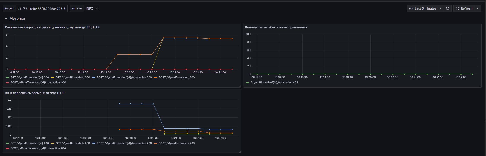
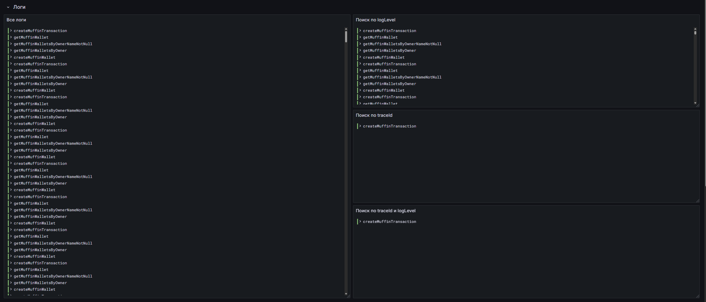
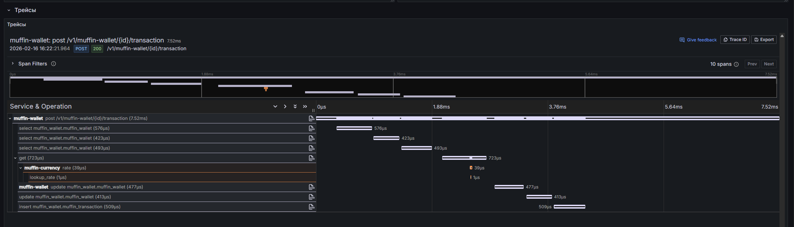

# Евсюков Александр БПИ224

## Задание
`Описание`

Развернуть приложения muffin-wallet и muffin-currency в среде Kubernetes (minikube) и настроить сбор
метрик, логов и трейсов с использованием opentelemetry.

`Задание`
- Разверните приложение muffin-wallet внутри кластера Kubernetes (minikube), используя
манифесты Kubernetes или Helm-chart.
- Разверните приложение muffin-currency внутри кластера Kubernetes (minikube), используя
манифесты Kubernetes или Helm-chart.
- Обеспечьте сбор логов из приложения muffin-wallet.
- Обеспечьте сбор трейсов системы.
- Обеспечьте сбор метрик системы.
- Подготовьте скрипты и дэшборды для демонстрации.


Можно сдавать без использования istio
  
`Штрафы`</br>
-4 Collector развернут в docker-comntainer
-2 Collector развернут не через operator
  
`Дедлайн сдачи`</br>
Задание необходимо демонстрировать на семинаре
18.02.2026 18:10

## Реализация
1. Разворачиваем OpenTelemetry Operator согласно [инструкции](OpenTelemetry Operator)
    - Устанавливаем cert-manager командой:
      ```bash
      kubectl apply -f https://github.com/cert-manager/cert-manager/releases/download/v1.19.2/cert-manager.yaml
      ```
    - Устанавливаем OpenTelemetry Operator командой:
      ```bash
      kubectl apply -f https://github.com/open-telemetry/opentelemetry-operator/releases/latest/download/opentelemetry-operator.yaml
      ```
    - Создаем манифест для OpenTelemetryCollector  
        ```yaml
        apiVersion: opentelemetry.io/v1beta1
        kind: OpenTelemetryCollector
        metadata:
          name: otel-collector
        spec:
          config:
            receivers:
              otlp:
                protocols:
                  grpc:
                    endpoint: 0.0.0.0:4317
                  http:
                    endpoint: 0.0.0.0:4318
          
            processors:
                  batch: {}
          
            exporters:
              zipkin:
                endpoint: http://host.minikube.internal:9411/api/v2/spans
          
              prometheus:
                endpoint: "0.0.0.0:8889"
          
              otlphttp/loki:
                endpoint: http://host.minikube.internal:3100/otlp
                tls:
                  insecure: true
          
              debug: {}
          
            service:
              pipelines:
                traces:
                  receivers: [otlp]
                  exporters: [zipkin]
          
                metrics:
                  receivers: [otlp]
                  exporters: [prometheus]
          
                logs:
                  receivers: [otlp]
                  processors: [batch]
                  exporters: [otlphttp/loki]
          
              telemetry:
                logs:
                  level: "info"
        ```
   - Подготавливаем Ingress для Prometheus, который будет ходить в коллектор
   - Создаем манифест для Instrumentation с autoinstrumentation-java по [инструкции](https://medium.com/opentelemetry/using-opentelemetry-auto-instrumentation-agents-in-kubernetes-869ec0f42377)
     и [документации](https://opentelemetry.io/docs/platforms/kubernetes/operator/automatic/#java):
     ```yaml
     apiVersion: opentelemetry.io/v1alpha1
     kind: Instrumentation
     metadata:
       name: muffin-wallet-instrumentation
     spec:
       exporter:
         endpoint: http://otel-collector-collector:4318
       propagators:
         - tracecontext
         - baggage
         - b3
       sampler:
         type: parentbased_traceidratio
         argument: "1.0"
       java:
         image: ghcr.io/open-telemetry/opentelemetry-operator/autoinstrumentation-java:latest
     ```
   - Заменяем путь к БД в `muffin-wallet/values.yaml`:
      ```yaml
      host: host.minikube.internal
      ```
   - Добавляем аннотацию в deployment muffin-wallet для автоматической инструментации/агентов OpenTelemetry:
     ```yaml
     annotations:
       instrumentation.opentelemetry.io/inject-java: "true"
     ```
   - Заменяем путь к коллектору в `muffin-currency/values.yaml`
     ```yaml
     otelUrl: otel-collector-collector:4317
     ```


## Отчет
### 1. Как запустить ваш кластер Kubernetes и развернуть приложение
   - Для запуска системы мониторинга и БД выполните команду:
      ```bash
      docker compose up -d
      ```
   - Перед запуском приложения выполните запуск манифестов из директории `otel-collector`:
     ```bash
     kubectl apply -f .
     ```
   - Для запуска приложения выполните команду:
     ```bash
     hemlfile sync
     ```
   - Для проверки приложения выполните команды:
     ```bash
     heml list
     kubectl get all
     ```
### 2. Как проверить работоспособность всех компонентов системы
   - Для создания тестовой нагрузки создайте пользователя типа PLAIN и CHOKOLATE и сохраните их id для дальнейшего использования в запросах
   - Запустите Jmeter скрипт командой (для корректной работы необходимо скорректировать id пользователей в запросах):
     ```bash
     jmeter -n -t load-test.jmx
     ```
   - На дашборде должна появиться следующая информация: 
    
    
    
