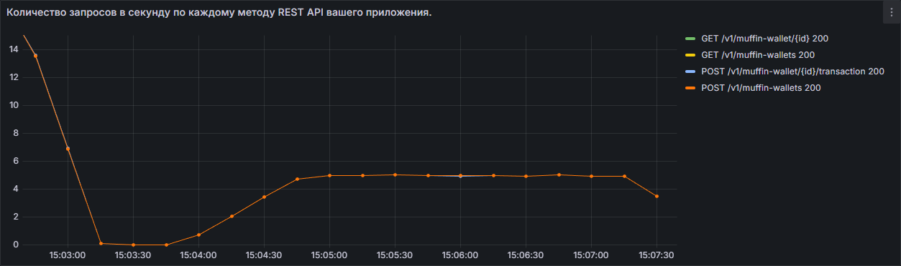
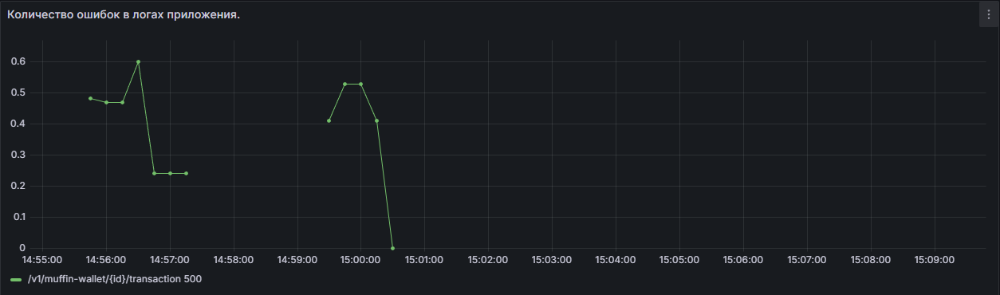
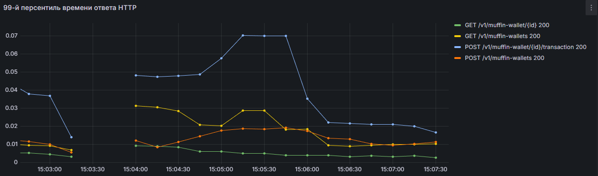
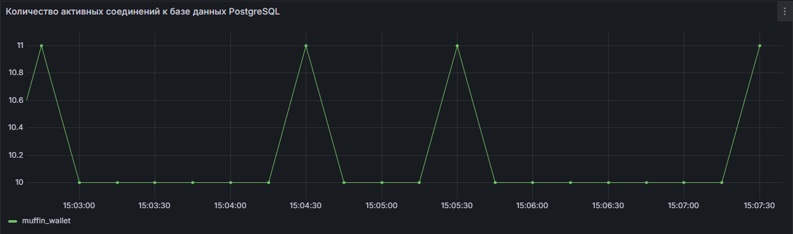

# Евсюков Александр БПИ224

## Задание
`Описание`

Развернуть приложение muffin-wallet в среде Kubernetes (minikube) и настроить мониторинг производительности с 
использованием Prometheus. Необходимо обеспечить сбор основных метрик приложения и инфраструктуры Kubernetes, 
включая количество запросов в секунду, процент ошибок, среднее время отклика и количество подключений к базе данных.

`Задание`
- Разверните приложение muffin-wallet внутри кластера Kubernetes (minikube), используя манифесты Kubernetes или Helm-chart.
- Обеспечьте сбор метрик непосредственно с контейнеров приложения. Prometheus может быть развернут в docker-compose. Любые запросы внутрь кластера через ingress.
- Используя PromQL-запросы, соберите следующие показатели:
  - Количество запросов в секунду по каждому методу REST API вашего приложения.
  - Количество ошибок в логах приложения.
  - 99-й персентиль времени ответа HTTP (обработка запросов).
  - Количество активных соединений к базе данных PostgreSQL.
- Подготовьте отчёт о проделанной работе с инструкцией:
  - Как запустить ваш кластер Kubernetes и развернуть приложение.
  - Как проверить работоспособность всех компонентов системы.
  - Инструкция по просмотру собранных метрик и убеждению себя в правильности их изменения.

Приложение muffin-wallet должно быть развернуто в minikube. Манифесты/helmfile/helmchart должны быть приложены.
Можно сдавать без использования istio

`Критерии оценивания`
- 0 - 4 Prometheus установлен, приложение запущено, но метрики не собираются.
- 4 - 6 Метрики собираются, но отсутствуют запросы (PromQL).
- 6 - 8 Метрики собираются, настроены PromQL-запросы и имеются инструкции по проверке их работоспособности.
- 9 - 10 Полностью выполненное задание с использованием оператора Prometheus, со сбором метрик Kubernetes, постоянным хранением метрик (например, в Thanos или Long-Term Storage).
  
`Штрафы`</br>
-2 балла, если приложение не развернуто в Kubernetes.
  
`Дедлайн сдачи 25.01.2026 23:59`

## Отчет
### 1. Как запустить ваш кластер Kubernetes и развернуть приложение
   - Для запуска системы мониторинга и БД выполните команду:
      ```bash
      docker compose up -d
      ```
   - Для запуска приложения выполните команду:
     ```bash
     hemlfile sync
     ```
   - Для проверки приложения выполните команды:
     ```bash
     heml list
     kubectl get all
     ```
### 2. Как проверить работоспособность всех компонентов системы
   - Проверьте, что все поды в namespace muffin-app находятся в состоянии Running:
     ```bash
     kubectl get pods -n muffin-app
     ```
   - Откройте туннель к кластеру minikube для доступа к приложению:
     ```bash
     minikube tunnel
     ```
   - Проверьте, что приложение доступно по ссылке (или по той, что указана у вас в hosts файле):
     http://muffin-wallet.ru/ 
   - Проверьте, что Prometheus собирает метрики, перейдя по ссылке:
     http://localhost:9090/targets
   - Проверьте, что Grafana отображает дашборды с метриками, перейдя по ссылке (готовый дашборд находится в корне проекта и называется `grafаna-hw-prometheus.json`):
     http://localhost:3000/ (логин: admin, пароль: admin)
### 3. Инструкция по просмотру собранных метрик и убеждению себя в правильности их изменения
Для получения метрик и создания тестовой нагрузки необходимо запустить Jmeter скрипт командой (для корректной работы необходимо скорректировать id пользователей в запросах):
```bash
  jmeter -n -t load-test.jmx
```
После запуска скрипта в Grafana на дашборде в [графане](http://localhost:3000/) можно наблюдать следующие метрики:
   - Количество запросов в секунду по каждому методу REST API вашего приложения
     ```promql
     sum(rate(http_server_requests_seconds_count{uri =~"/v1/.*"}[$__rate_interval])) by (method, uri, status)
     ```
     Из-за особенностей нагрузки видно, что графики почти полностью совпадают </br>
     
   - Количество ошибок в логах приложения
     ```promql
     sum(rate(http_server_requests_seconds_count{uri =~"/v1/.*", status=~"4..|5.."}[$__rate_interval])) by (uri, status)
     ```
     Во время тестирования нагрузки я подал слишком большой поток запросов, поэтому система не справилась и один из запросов начал отдавать статус 500.</br>
     
   - 99-й персентиль времени ответа HTTP (обработка запросов)
     ```promql
     histogram_quantile(0.99, rate(http_server_requests_seconds_bucket{uri=~"/v1/.*"}[$__rate_interval]))
     ```
     На графиках видно, что некоторые запросы выполняются дольше других, так как либо требуют записи в БД, либо обращаются к сервису currency.</br>
     
   - Количество активных соединений к базе данных PostgreSQL
     ```promql
     sum(pg_stat_activity_count{datname="muffin_wallet"}) by(datname)
     ```
     На графиках видим количество активных соединений к базе данных, которое изменяется в зависимости от нагрузки.</br>
     

